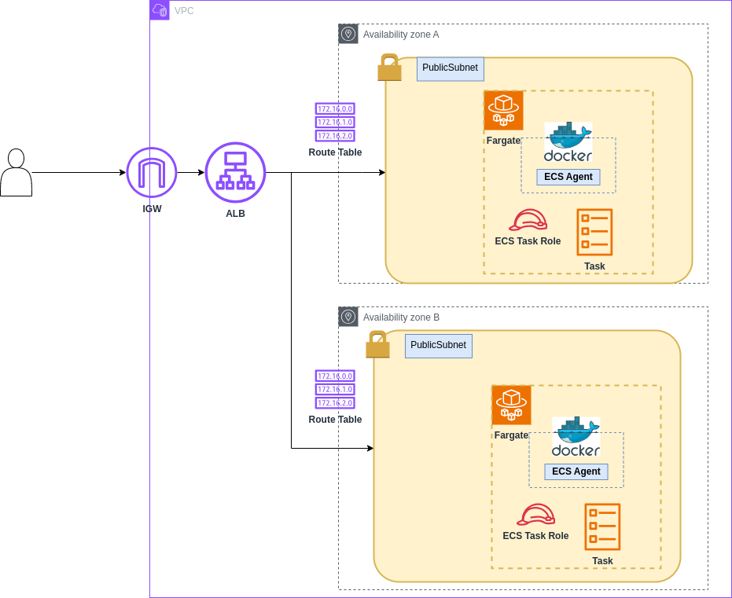

# DevOps Test Application

## Prerequisites

1. Docker and Docker Compose
2. AWS CLI configured with appropriate credentials
3. Terraform installed locally.

## Infrastructure Overview


## Local Development
1. Build and run the application:
   ```bash
   docker compose up
   ```

2. Run tests in container:
   ```bash
   docker compose run app poetry run pytest -s
   ```

## Infrastructure Overview

The application is deployed on AWS using the following components:
- Amazon ECS (Fargate) for docker images.
- Application Load Balancer (ALB) for load balancing.
- Amazon ECR for container registry.
- VPC with security groups.
- IAM roles and policies for ECS tasks.

## CI/CD Pipeline

The application uses GitHub Actions for continuous integration and deployment. The pipeline is triggered automatically on:
- Push to main branch
- Pull requests to main branch

### Pipeline Stages

1. **Test Stage**
   - Runs unit tests using pytest in a Docker container
   - Must pass before proceeding to next stages

2. **Build and Push Stage** (only on main branch)
   - Builds Docker image
   - Authenticates with AWS ECR
   - Pushes image to ECR repository
   - Tags image with commit SHA

3. **Deploy Stage** (only on main branch)
   - Downloads current ECS task definition
   - Updates task definition with new image
   - Deploys to ECS service
   - Waits for service stability

### Required GitHub Secrets

The following secrets need to be configured in your GitHub repository:

- `AWS_ROLE_ARN`: ARN of the IAM role for GitHub Actions to assume

### Pipeline Configuration

The pipeline configuration is defined in `.github/workflows/ci-cd.yml` and uses the following environment variables:

```yaml
AWS_REGION: ap-southeast-1
ECR_REPOSITORY: devops-test
ECS_SERVICE: devops-test-service
ECS_CLUSTER: devops-test-cluster
ECS_TASK_DEFINITION: task_definition/task-definition.json
CONTAINER_NAME: devops-test-app
```

- Output:
```bash
[<aws-profile-name>]
aws_access_key_id = XXXXXXXXXXXXXXXXXXXX
aws_secret_access_key = xxxxxxxxxxxxxxxxxxxxxxxxxxxxxxxxxxxxxxxx
```

## Terraform Infrastructure Deployment

### 1. Create an AWS Access Key & Secret Key
- Follow the guide: [How to create AWS Access & Secret Keys](https://k21academy.com/amazon-web-services/create-access-and-secret-keys-in-aws/)

### 2. Configure AWS Credentials.
```bash
export AWS_ACCESS_KEY_ID=<AWS_ACCESS_KEY_ID>
export AWS_SECRET_ACCESS_KEY=<AWS_SECRET_ACCESS_KEY>
```

### 3. Start terraform
1. Initialize Terraform:
   ```bash
   cd terraform
   terraform init
   ```

3. Review the infrastructure plan:
   ```bash
   terraform plan
   ```

4. Apply the infrastructure:
   ```bash
   terraform apply
   ```

## Infrastructure Components
The Terraform configuration includes:

1. **VPC and Networking** (`vpc.tf`):
   - VPC configuration
   - Public and private subnets setup

2. **ECS Cluster** (`ecs.tf`):
   - Fargate cluster configuration
   - Task definitions and services
   - Container deployment settings

3. **Security** (`security_group.tf`, `iam.tf`):
   - Security groups for ALB and ECS tasks
   - IAM roles and policies for ECS execution

4. **Load Balancing** (`alb.tf`):
   - Application Load Balancer configuration
   - Target groups and listeners

5. **Container Registry** (`ecr.tf`):
   - ECR repository for storing Docker images

## Configuration

The main configuration variables are in `variables.tf`:
- `app_name`: Name of the application (default: "devops-test")
- `aws_region`: AWS region for deployment (default: "ap-southeast-1")
- `app_port`: Application port (default: 3000)

## Clean Up

To destroy the infrastructure:
```bash
cd terraform
terraform destroy
```